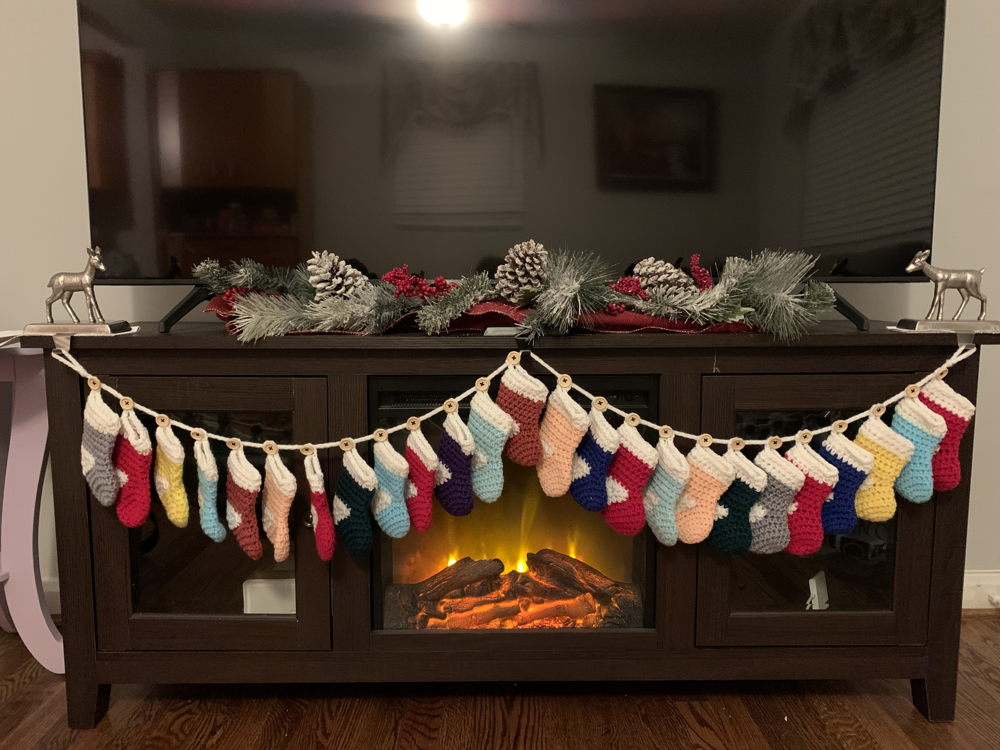



(Feb 2020 - Nov 2021) Mini stocking advent calendar

## Details
- Yarn: Assorted worsted weight
- Hook size: 4mm I think?  
- [Pattern](https://www.hobbycraft.co.uk/ideas/decor-hobbies/how-to-crochet-a-mini-stocking-advent)
- Made for: me and Joe :)

## Notes 
Not many modifications to this pattern (although I will say that at first I did try going up and going down in # of stitches for the advent calendar and it was either way too big or way too small - follow the pattern). The only thing is, I plan to attach buttons along the long single crochet chain so that the mini stockings are removeable. Joe and I were thinking that when we have kids, it can be an advent tradition to hide the mini stocking somewhere in the house with some chocolate inside, the kids need to find the stocking, and then they hang it up on an open button. I still need to figure out how to attach the buttons to the sc chain - will update when I've done it.

This project was really quick at first! The mini stockings are really fast to make and it was super satisfying to finish them so quickly. The problem is that in the middle of this project, we went to Hawaii because of COVID and I didn't bring it back with me. And then when we came back to California to pack up, I finished the rest of the mini stockings super fast! But I needed buttons for the sc chain and I didn't want to buy them right before the move so I waited til after the move. Well after the move, we never even unpacked because our life is so up in the air! So the mini stockings are still packed away. I bought buttons though! But I need to figure out how to attach them, and anyways it wasn't urgent to finish by Christmas 2020 anyways because we are just hopping between houses. So I will probably just unpack the mini stockings whenever we settle down (***if*** we ever settle down) and then finish up the sc chain then. 

### Nov 2021 Update

Well we finally settled down this year and given that we started decorating for Christmas, it was urgent that I finally finish this advent calendar! I made a 2 stitch i-cord for the garland holder (see [video](https://www.youtube.com/watch?v=vhr-Ovs5MOc)) and then attached the buttons to the rope to hang each of the stockings. 

A couple hiccups happened though :( 
- When I first started attaching the buttons, I wasn't paying too much attention to the underlying icord and it is a bit twisted. One thing to note for the future is that the icord should be not twisted as the buttons are attached otherwise they will point in all crazy directions. Well the buttons will probably point in all crazy directions anyways (see 2nd bullet) but even more so! 
- I think because the 2 stitch i-cord had a bit less structure than say a 3 stitch i-cord, it was a bit hard to get the buttons sewn in and pointing in the right direction. Maybe I should have done a 3 stitch i-cord but I like the thickness of the 2 stitch one. So perhaps wouldn't change this even if I were to redo it but something to consider
- I used black embroidery floss and a regular darning needle to sew the buttons to the garland which worked fine but perhaps I should have sewn in the ends better (I just did a triple knot in the back and cut with some tails). It looks fine the front and when the stockings are hanging on the buttons, but if the buttons are poking in different directions then the tails on the back of each button don't look very good
- Perhaps the BIGGEST hiccup was that when I was adding the loops on each individual stocking, I wasn't paying too much attention to where the loop was as long as it was vaguely near the left (heel) side of the stocking. Well the problem with having loops that are directly at the fold of the stocking is that then when you hang it on a button, the stockings point *straight* forwards which doesn't look good at all. So I ended up undoing every single stocking and moving the loop so that it was near the fold still but clearly still on the back side of the stocking. This means that when you hang up the stocking on the button, it points at an angle so you can still see it but it also is more space efficient because each stocking overlaps a bit with the next one. Not a big deal considering it was just the very last row and it was super quick to redo the slip stitch row but it was a bit tedious. 
- We were originally planning on putting the stockings near our fake fireplace TV stand but because the stockings are so massive, they needed to go in the dining room (which is where the advent calendar was originally supposed to go) but the TV stand is shorter than dining room spot we were originally thinking. So we had to overlap each stocking which I think ended up being better than no overlap anyways (each button is about 2" away from each other) so ended up not really being a hiccup at all! 
- I definitely underestimated how heavy the stockings would be. And because I made an i-cord which is first of all stretchy and also with acrylic (aka stretchy) yarn, just hanging it would have meant that the garland would hang really low. So we bought another plain stocking holder and there is an intermediate point to hang up the advent calendar, and I think it actually looks really nice like this! 
- Relating to the first couple hiccups, because the buttons don't look so good when the stockings aren't hanging on them and weighing them down to point in the right direction, our original plan of putting up one stocking per day of advent isn't really going to work out because otherwise all the non-hanged buttons will look bad for most of the month. So the LATEST plan is to instead make a bird amigurumi and it will poke out of the stocking and each day we will move it along the advent calendar. Less exciting but at least this way we will get to enjoy the advent calendar fully up for the whole month :) We had also tossed around ideas around putting candy in each stocking, putting a short workout and/or scavenger hunt clue in each stocking, etc. but the problem is that 1) candy is unhealthy, and 2) we have to come up with the short workouts / scavenger hunt clue and that seemed like too much work. So at least this year, we will probably just go with the little bird. See my [bird post](../knit/bird.md) to see how that is coming along! 


