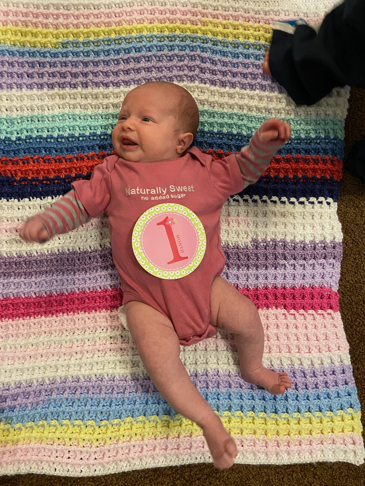

# Annie's blanket

[*Back to home page*](..)

(Feb 2020 - May 2020) My first baby blanket, for Elaina's 3rd born and my first goddaughter! 

Isn't she a cutie :) 

## Details
- Yarn: Bernat Softee Baby Stripes
- Needle size: don't remember :( 
- Pattern: [waffle stitch](https://bellacococrochet.com/waffle-stitch/)
- Made for: Annie, Elaina's 3rd child and my first (and so far only) goddaughter! 

## Notes 
This yarn was on big sale at Joann's so I bought two skeins of it (my favorite colored skeins at the top and the bottom) and thought that would be enough for a baby blanket! Boy, was I wrong. I've heard that crochet is a yarn eater, and especially that the waffle stitch is a yarn eater. Two skeins of this was nowhere close to enough! 

So I went back to Joann to buy more yarn but they were out of my colorway :( So I bought a few others which I hoped wouldn't look TOO bad with this one and just kept on crocheting until I ran out. So it is a little crazier/rainbow than I had originally planned for. 

This project took a fair bit longer than most other projects because we were in California when I started it, but then COVID hit and Joe and I went to Hawaii and we were obviously busy in Hawaii and as a result, I didn't have as much time to crochet. But it is done and and gifted off to the recipient who you can see pictured above :) 
