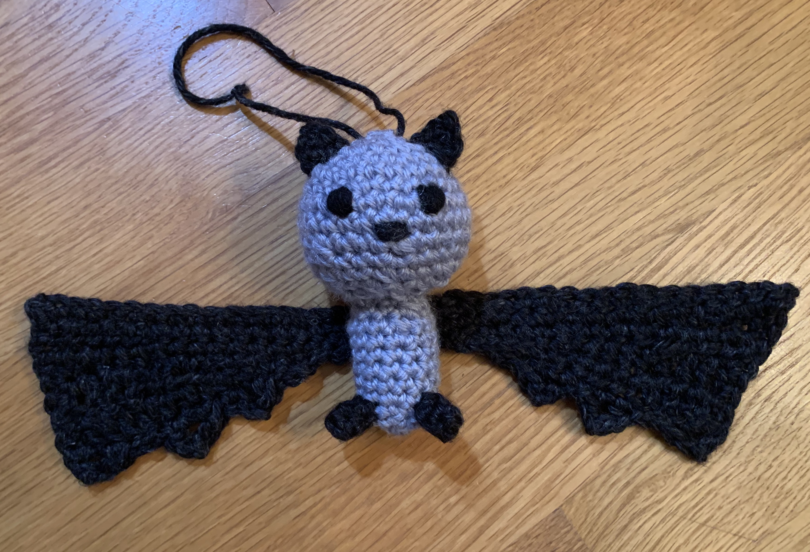

# Bat amigurumi

[*Back to home page*](..)

(Aug 2020) My first amigurumi in awhile and boy, do I remember why I didn't like making amigurumis.

## Details
- Yarn: Assorted worsted weight
- Needle size: 5mm
- [Pattern](https://www.ollieholly.com/blog/2019/09/27/free-bat-amigurumi-crochet-pattern)
- Made for: my mom for her birthday in 2020 

## Notes
So let me explain the origin of this idea. My parents' house has TERRIBLE mosquitoes in the summer. This is because my mom is a crazy plant lady on top of being a crazy environmental/recycling lady. So she has a bunch of plants ALL around her yarn that she has to water throughout the summer, but she doesn't like wasting water, so instead, she has a bunch of buckets out all around the house which are intended to collect rain water. Some of them are formal rain barrels and properly sealed off, but others are just open wheelbarrows collecting rain water. Well this inevitably means that there is a bunch of standing water on the days after a rain before she uses up the water for her plants. So there are TONS of mosquitoes literally everywhere outside our house. Well she is also a crazy animal lady, so my brilliant idea for her birthday present (somewhat self-serving I know) was to get her a bat box. It's like a birdhouse (which she has around the yard and likes) and I've seen bats flying around outside our house at dusk before, so I figured it could 1) attract bats to the property which is a fun new animal she hasn't learned much about yet, and 2) the bats can EAT ALL THE MOSQUITOES! It is a win/win. So I bought her a bat box but to make it a little bit more cutesy of a gift, I decided to also make her a bat amigurumi to go with the gift. 

The pattern called for sport weight yarn but, being the cheapo that I am, I was trying to use up my cheap acrylic yarn! And the pattern called for safety eyes, but I didn't have any and I didn't really want to buy any just for this purpose. So I had to adapt the pattern (mostly freehanded based on how it looked) for the heavier weight yarn so the bat wouldn't be huge. The only thing I didn't adjust was the wing (which did end up disproportionately large) and I put a coat hanger in through the top of the wing to keep it stiff. 

It had been awhile since I crocheted when I did this project (I have been knitting mostly for the recent past). Everyone always talks about how crochet is more of a yarn eater, and boy is it true! I was trying to use up scrap yarn and kept running out of yarn because crochet takes so much more yarn! Also it's been awhile since I've done amigurumi or anything requiring sewing - I think the last time was the Mother's Day apron with the terrible appliques and before that was a giraffe rattle that I made for Rachel's kids but I don't have a picture of it. Anyways, boy do I remember why I didn't like making amigurumis, sewing the pieces all together is so boring. It always looks cute when you see pictures but it never looks as good without safety eyes and sewing pieces together is the WORST. 

Also in case you were curious, when I gave my mom the bat box, I said very explicitly, "I thought you might like this, but if you won't put it up, *please tell me in the next week so I can return it*. I won't be offended. I just don't want it sitting in a corner of junk collecting dust." She told me in no uncertain terms that she liked it and wanted to keep it. Guess what? It is sitting in a corner of junk collecting dust. Which means more mosquitoes next summer :( 
