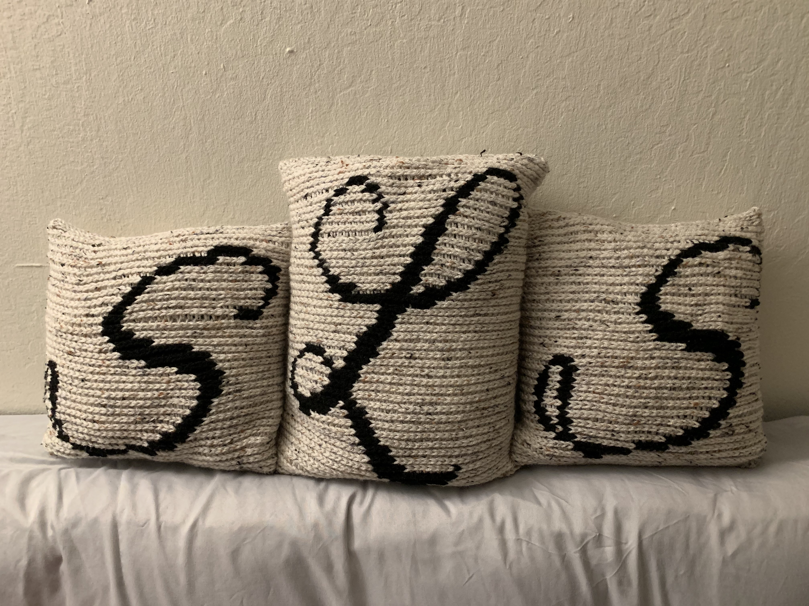

# Bridesmaids' pillows

[*Back to home page*](..)

(Jul 2019 - Sep 2019) Crocheted pillows for my bridemaids.

## Details
- Yarn: Red Heart Super Saver, Aran Twine and Black
- Needle size: 5.5mm
- [Pattern](https://hearthookhome.com/throw-pillow-cover-free-crochet-pattern/)
- [L chart](https://www.stitchfiddle.com/en/c/siln0i-70qe6e)
- [S chart](https://www.stitchfiddle.com/en/c/sinxx1-2ecpuv)
- Made for: my bridesmaids as thank you gifts for our wedding! 

## Notes 
I carried the black for the duration of the letter and the dropped it after the letter was done. I carried it back to the start of the row (sometimes having 2 bobbins of working yarn for very wide section) and knit over it so hide the float on the inside. I used a standard polyester pillow insert for the inside. 12"x12" for the S pillows and 12"x16" for the L pillow (maid of honor). I could've added a zipper for ease of cleaning but I was too lazy :) 
