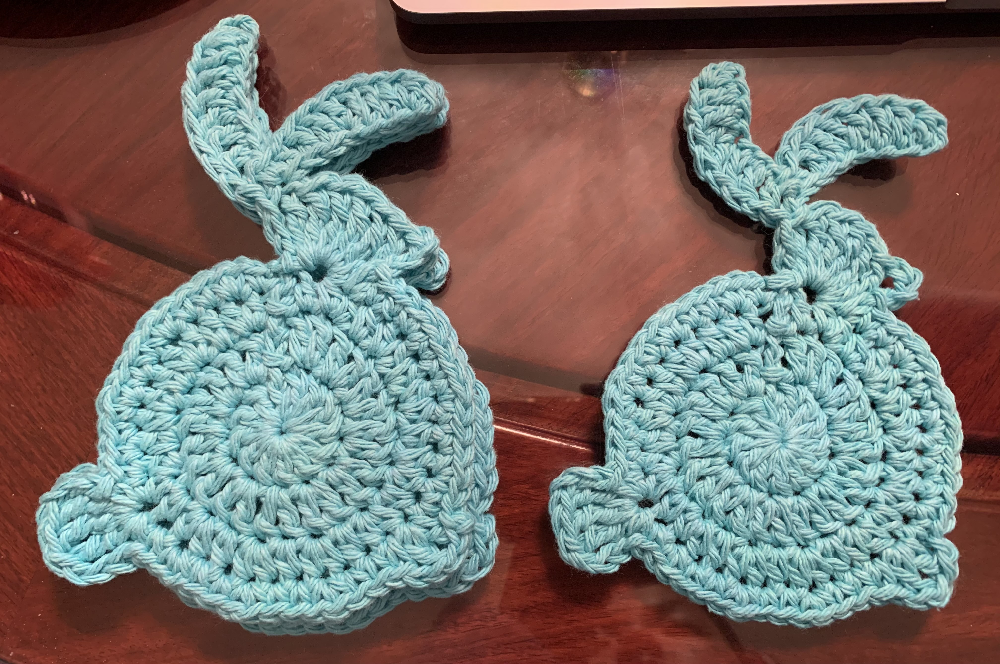

# Bunny coasters

[*Back to home page*](..)

(Mar 2021) Bunny coasters

## Details
- Yarn: Peaches & Creme, 100% cotton 
- Hook size: 4.25mm
- [Pattern](https://www.garnstudio.com/pattern.php?id=9083&cid=19)
- Made for: Summer for Easter! Jen has been asking for light coasters

## Notes

I made four of these for a full coaster set! 

This is the first time I have ever followed a totally charted pattern! It was so interesting and a bit unintuitive at first, but I figured it out. Instead of chaining a loop at the beginning, I used magic loop with the 12 double crochets directly into the magic loop. Also in order to make the body big enough for a coaster, I did two rounds of double crochet followed by the hdc round and the sc round. 

They turned out super cute! I hope Summer likes them :) It is Easter this Sunday.


