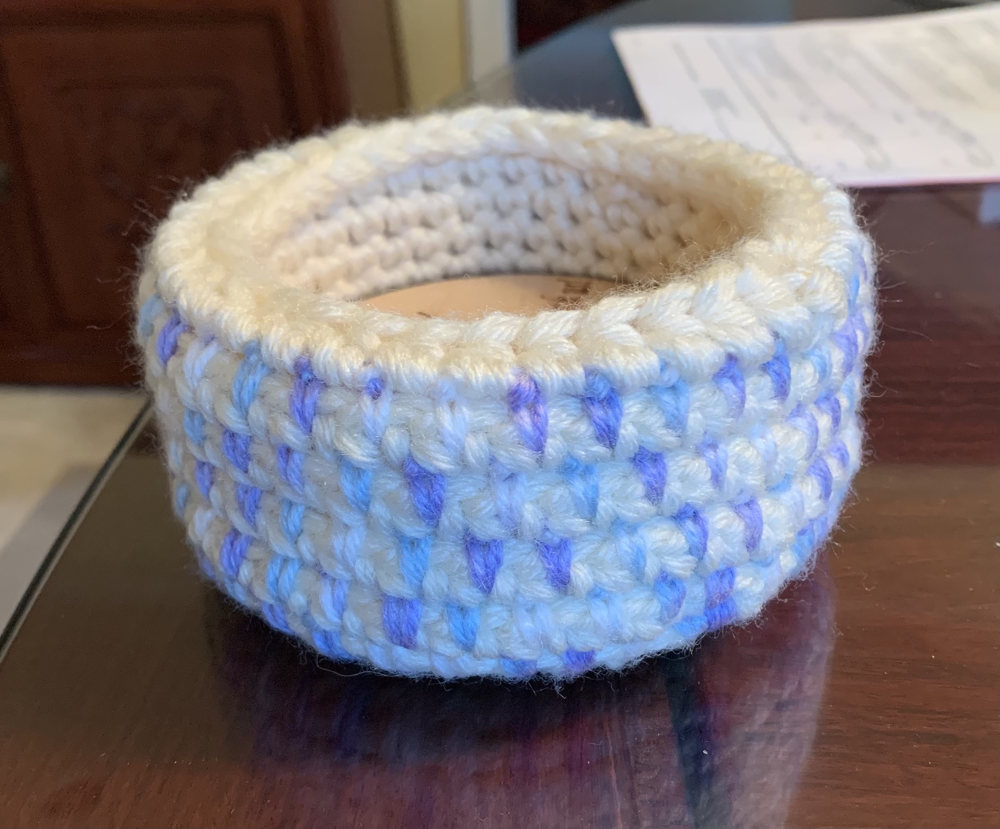



(Mar 2021) Coaster basket

## Details
- Yarn: Assorted worsted weight (creme, variegated blue yarn)
- Hook size: H (5.0mm), 5.5mm
- [Pattern](https://yarnandchai.com/mosaic-basket/)

## Notes

I held the creme yarn triple (check out this [nifty trick](https://www.youtube.com/watch?v=tieArIwQ9Vk)!) and followed the pattern for the small basket. The base of the basket perfectly fit the size of the coasters, but once I built the walls of the basket, it was a tad bit big. I was thinking about skipping the inner lining but given that the basket was a bit big, I decided to do the inner lining. The first time I crocheted it though, it made the inside of the basket a little too small. The coasters still fit, but it took a bit too much fiddling in order to be convenient. So I decided to frog, hold the yarn double, and then do the inner lining so it was thinner. Unfortunately with this though, it made the inner lining too small and didn't lay flat against the walls. So I frogged again and switched to a bigger hook (5.5mm) and crochet the inner lining again with theyarn held double. Bound off andeverything is beautiful! I haven't decided yet whether I will add the plastic lining or not, but I think I probably will next time I go to Michael's/Joann :) 

Also this pattern was lovely! A lot of patterns I looked at seemed to give the basket stiffness through a small hook crocheted really tight which hurt a lot of people's hands, but this one is smarter by doing multiple layers and using the plastic canvas! I am planning on making more baskets with this strategy - circular and rectangular :) 


