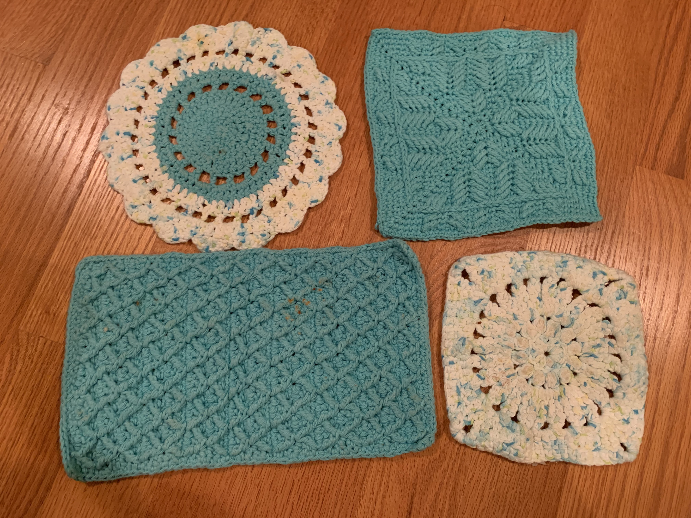

# Hot pads

[*Back to home page*](..)

(2019, 2020) Assorted hot pads of different sizes/shapes

## Details
- Yarn: Peaches & Creme, 100% cotton
- Hook size: 5mm
- Patterns: Starting from the top left and going clockwise: 
    - [Crochet mandala rug](https://crafts.tutsplus.com/tutorials/crochet-a-gorgeous-mandala-floor-rug--craft-6032)
    - [Square 4 from the Wrapped in Jamie CAL](https://blacksheepcrochet.com/wrapped-in-jamie-cal-square-4-guarding-his-right-pattern/)
    - ? 
    - [Diamond waffle stitch](https://bellacococrochet.com/diamond-waffle-stitch/)
- Made for: me and Joe :)

## Notes 
These work pretty well! The ones with holes in them allow some heat through more easily so condensation will build up between the pot/pan and the table. Those two are best when combined with another. I am thinking about making double thick ones in the future. 
