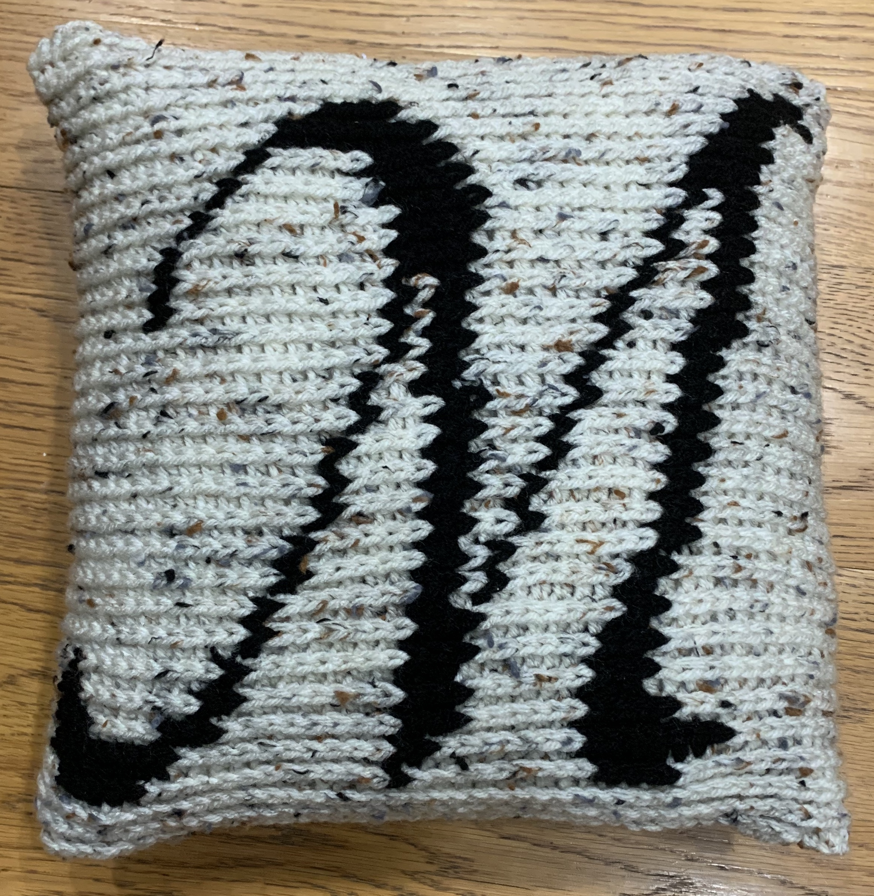

# M pillow

[*Back to home page*](..)

(Sept 2020 - Oct 2020) My first almost commission, an M pillow! 

## Details
- Yarn: Red Heart Super Saver, Aran Twine and Black
- Needle size: 5.5mm
- [Pattern](https://hearthookhome.com/throw-pillow-cover-free-crochet-pattern/)
- [M chart](https://www.stitchfiddle.com/en/c/si1ih7-k30rc)
- Made for: Soumya's roommate

## Notes 
This was my first almost commission! Let me explain.

Soumya was one of my bridesmaids so for my wedding, as a thank you gift, I had made and given her a pillow with an S on it (among a couple other things). Well apparently she loved it so much that she asked if she could pay me to make her another pillow but this time for her roommate, Mel! I was so flattered! My first commission! I was originally thinking about asking for her to pay for materials only, but then materials were like $15 so it just seemed unnecessary. So I told her I would just make it for her for free because it is so heartwarming and flattering that she liked her pillow so much! So I ended up just doing it for free but still! My first almost commission! 

Same 12"x12" pillow insert as I used for Soumya's, same yarn, same pattern, and just a new chart. 
