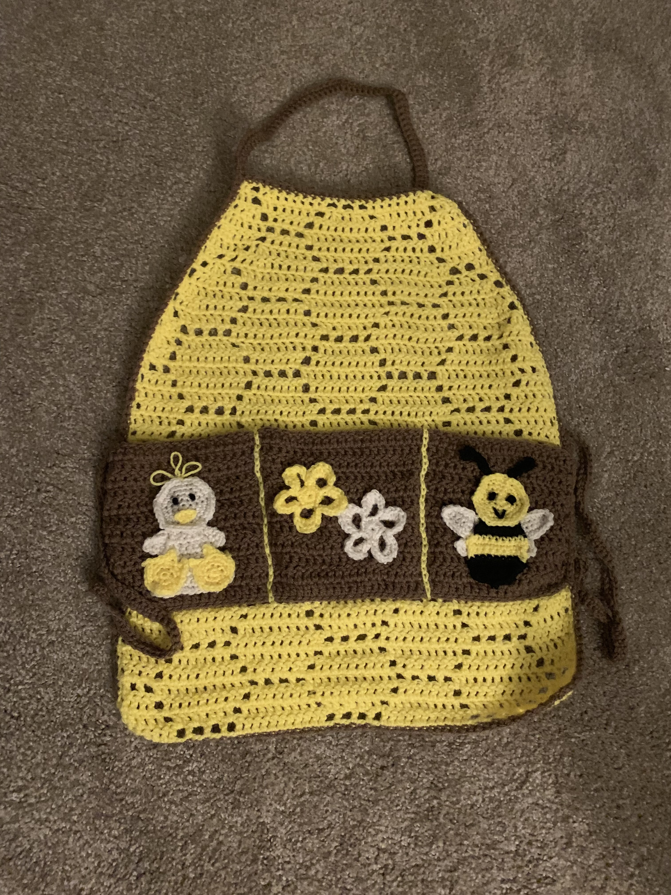



(Apr 2019 - May 2019) Bee/chicken/flower themed cooking apron with pockets.

## Details
- Yarn: Assorted worsted weight
- [Pattern](https://www.yarnspirations.com/on/demandware.static/-/Sites-master-catalog-spinrite/default/dw16bafcd8/PDF/SCC0137-005167M.pdf).
- Made for: my mom for Mother's Day 2019

## Notes 
I very roughly followed the pattern for the shape of the apron, but otherwise I used honeycomb filet crochet for the base. I found chicken, flower, and bee applique patterns online (I think, or freehanded?) and sewed them onto the pockets! Unfortunately, my mom thinks it is too cute and she never uses it. It just hangs on a chair even though it is machine washable! :(


