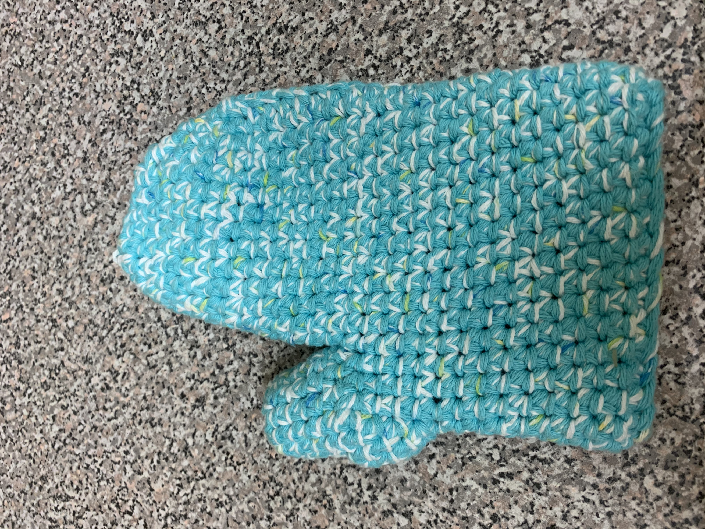

# Oven mitt

[*Back to home page*](..)

(June 2019) My second oven mitt

## Details
- Yarn: Peaches and Creme yarn, 100% cotton
- Needle size: don't remember :( 
- [Pattern] (https://www.favecrafts.com/Kitchen-Crochet/Easy-Oven-Mitts-Crochet-Pattern)
- Made for: our cooking selves :) 

## Notes 
This was crocheted holding 3 strands together for a thicker fabric. My first oven mitt was a little small (especially to slip over the watch on Joe's left hand) so I decided to make another one which was bigger and also had a little bit more curvature to it. The first oven mitt was very boxy at the fingers, whereas for this one I modified the pattern slightly so it tapered more nicely. I don't remember what specific modifications I made unfortunately.

The oven mitts work very well! Thicker than most regular cheap oven mitts I have used and pans don't get hot in my hand at all (it sometimes gets a bit warm after ~20 seconds). I should make more because they are so wonderful but 100% cotton is a pain to work with on the hands. There is no stretch or give at all so it is just really tiring to tension. But 100% cotton is necessary for anything that gets hot so it won't melt. So it is worth it I guess :) 
