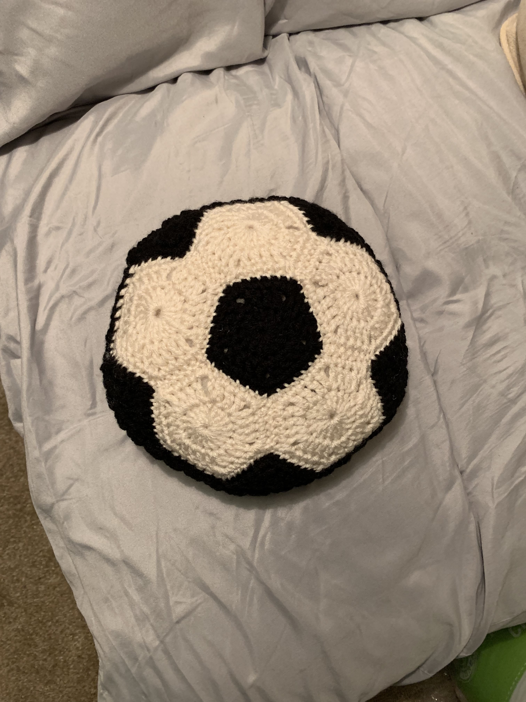



(May 2019) Soccer ball pillow for a soccer lover

## Details
- Yarn: Red Heart Super Saver
- Made for: my dad for Father's Day 2019

## Notes 
I freehanded the pattern! I wanted a flat-ish pillow instead of a spherical soccer ball. My approximate pattern below: 
- The following makes one side: Make 5 white hexagons, 1 black pentago, and 5 black trianges. Sew all pieces together so it looks like a soccer ball. 
- Make 2 for 2 sides
- Sew the two sides together, connected by a black strip between the two sides.


