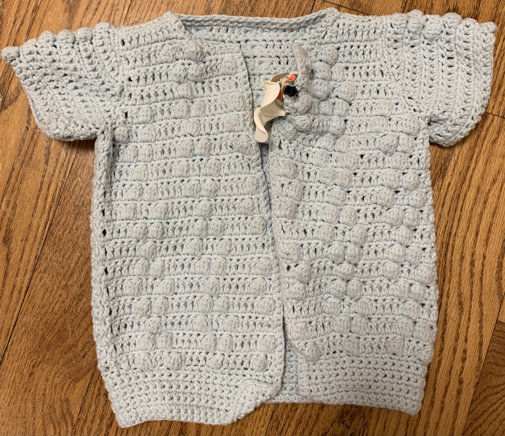

# Summer's sweater

[*Back to home page*](..)

(Aug 2019 - Sept 2019) My first wearable, albeit for a little baby

I need to add a picture of Summer wearing it too before she grows out of it! But maybe then Winter can wear it. 

## Details
- Yarn: Lion Brand Feels Like Butta, Ice 
- Needle size: don't remember :( 
- [Pattern](https://web.archive.org/web/20130724113136/http://www.petitepurls.com/Spring11/spring2011_c_pearls.html)
- Made for: Summer's first birthday

## Notes 
I don't really know anything about fibers besides that acrylic is cheap and wool/alpaca/anything else really is nice and expensive. But this was some new line of yarn put out by Lion Brand (100% polyester) and it was soft and there was a baby on the yarn sleeve and most importantly, it was on sale, so I figured I might as well give it a shot and see how it is. I still have no idea if 100% polyester yarn is good or not for babies. 

Anyways, Jen, Andy, and Summer were visiting California at the end of September and Summer's first birthday was just a couple days after they were supposed to leave. So I figured I would make a little something for Summer and it was also an excuse to make some baby clothes. Sizing was super hard because 1) I am too impatient to make a gauge swatch so I don't know how my gauge compared with the pattern, and 2) it was really hard not having Summer there to try it on and adjust to her size. So I think it ended up a little giant for her (especially because Summer is a small toddler anyways) but Jen vehemently says it is the perfect size. Who knows. 

I should have added buttons to the front or a tie or something so that it could tie closed but I was worried about buttons being a choking hazard and I was too lazy to add a tie. So instead it just hangs open which I think is a little unideal :( 

The other thing which ***pains*** me still is that I messed up the pattern on one of the shoulders where instead of doing a big diamond (1 bobble, 2 bobbles, 3, 2, 1) I accidentally did a small diamond (1 bobble, 2 bobbles, 1). I was so upset and I probably would've frogged back to fix it but I had already binded off the end. And I guess no one will really notice. But I felt so dumb, especially giving it as a gift. 

The yarn was pretty soft and pretty nice to work with. But I did definitely decide (I had been sort of thinking this before too) that knit is much better for garments because I don't like the look of the holes from crochet. I think this is one of the big reasons why I decided to try out knitting! 
