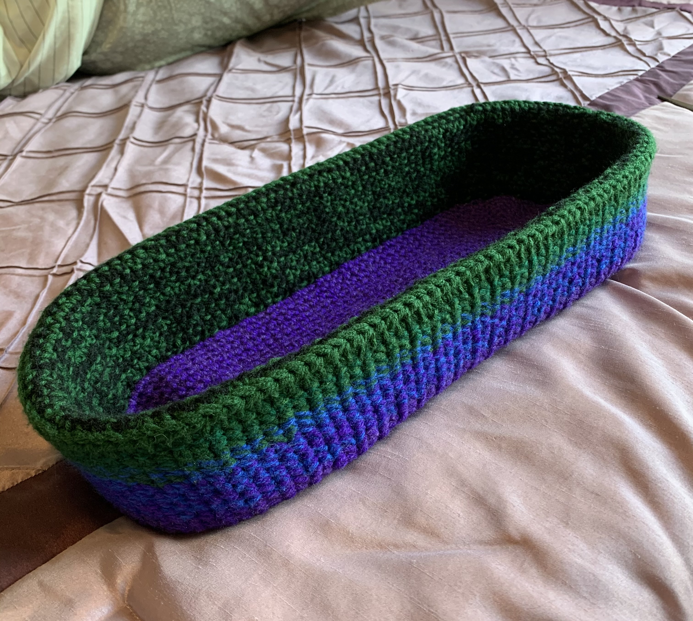



(Mar-Apr 2021) Toilet paper basket

## Details
- Yarn: Assorted worsted weight
- Hook size: 5mm, 4.25mm
- Loosely based on this [pattern](https://yarnandchai.com/mosaic-basket/). 

## Notes

This was the most effective stash buster ever! I used up all of my scrap purple, blue, and green yarn, and the basket doesn't even look too much like a stash-buster project! This was a follow-up project to the [coaster basket](coaster_basket.md) I made and used the same strategy of multiple layers for the wall and putting plastic canvas in between. I held 2 strands of yarn together while crocheting and as I ran out of one color, I would sub in a new color so it's more of a gradient instead of blocks of color. Because the project was so big and not rotationally symmetric, I added plastic canvas in between the walls and then sewed down the inner wall to make sure it lay properly. 

The project itself was a bit of a pain to crochet - it was a big project so a bit slow-going and holding the yarn double was no fun. I took a couple miscellaneous breaks, but it's done now and with plastic canvas (which was sooo important otherwise the basket was way too floppy)! And one of my main goals was to make something useful for our new house, so hopefully this will be useful! 

### Pattern recipe
I crocheted a chain and then crocheted around it until I got an oval big enough for 3 rolls of toilet paper to fit inside. I didn't want to count my stitches so I just eyeballed it to figure out where to put the increases to make sure it was still evenly increasing around the ends of the oval. For the body of the basket, I alternated [sc](../glossary/#single-crochet-sc) and sc [tbl](../glossary/#through-back-loop-tbl) to give it a bit of texture and a bit more structure. To turn up the wall, I did sc tbl and continued until I got to the top. At the top, I did one row of [hdc](../glossary/#half-double-crochet-hdc), switched to the smaller hook size, and then sc tbl before continuing onwards in pattern (alternating sc and sc tbl) until reaching the bottom of the basket. I cut plastic canvas to size, added it between the walls, and then sewed down the inner walls to keep everything in place. 


