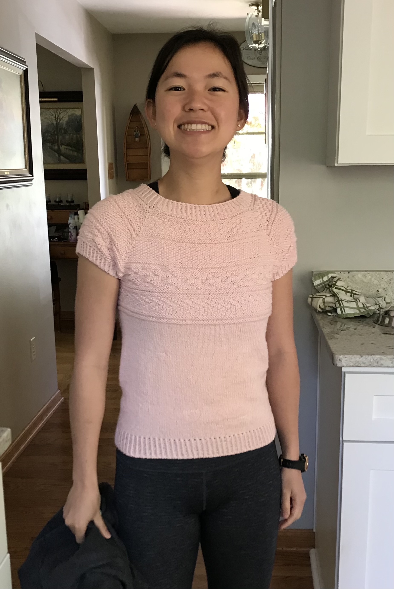



(Apr 2021 - ongoing) My first knit wearable! 

## Details
- Yarn: King Cole Finesse Cotton Silk DK (77% cotton, 23% silk), x skeins
- Needle size: 5 and 6 
- Pattern: [Battersea shirt](https://incorrigiblecraftster.blogspot.com/2015/04/battersea-free-pattern.html)

## Notes

I have been wanting to make a knit wearable for some time now but given that I missed making a sweater in time for winter, I decided to try my hand at a knit shirt. I figure this will be good too because it's less commitment than a full blown sweater. I found a nice free pattern with lots of positive reviews, so here goes! 

## Timeline 

- 4/3/2021: Bought the yarn! I went to the most wonderful yarn store (the only yarn store I've ever been in) in downtown Vienna and they had so many different types of yarns and tools! I've heard before that if you want to make a summer shirt, it's best to use cotton (so it can breathe more) vs. if you want to make a winter sweater, it is better to use wool (so it is warmer). The lady at the yarn store mentioned that 100% cotton yarns can get sort of heavy, but if you use a cotton blend with silk, cashmere, etc. then it makes the yarn a bit lighter and flowier/lighter/softer. I saw super torn between 3 yarns: 
  1. Berroco Remix Light: cotton blend with mostly nylon, cotton, and acrylic, with a bit of silk and linen thrown in. This would've been $24 with probably a bit of yarn leftover (so maybe more like $20-22?) and is machine washable! 
  2. King Cole Finesse Cotton Silk Yarn: cotton blend with mostly cotton and some silk to make it lighter and airier. This would've been $30 with maybe a very little bit left over. It is hand wash only.
  3. Some cotton blend with cashmere which was super nice and soft. I don't quite remember, but I think this was closer to $50 and I'm guessing was hand wash only.

  Anyways I ended up just getting #2 because it wasn't too much more expensive than #1 and I've always heard that acrylic is bad (although I felt some of the softest acrylic ever in this wonderful yarn store!). But boy is this going to be the most expensive shirt ever! I figure it is the entertainment of it too hopefully. And if I don't need as much yarn, then I can return 1 ball (within 30 days of purchase for store credit) and it will only be $25! Still a lot though :( 
  
  I've heard that gauge swatches are really important for wearables so I made my first gauge swatch. I knit it flat instead of in the round with long floats which maybe would've been more accurate. Honestly, I don't know if it really will help me at all though. These were my gauge results (where when I say blocked, I really just mean soaked in cold water and lain flat to dry, not pinned): 
    - Pattern calls for: 18st x 32 rows 
    - My gauge swatch (unblocked): 20st x 29 rows 
    - My gauge swatch (blocked): 20st x 30.5 rows
  I guess by this, it would mean that I had to go up a size to match the st gauge (which is apparently more important than row gauge) but I don't want there to be too many holes in my shirt otherwise it will be see-through and I was actually thinking about going down a needle size instead of up! Anyways so I just decided for now that I will do the same needle size and perhaps go up a size in the pattern than I otherwise would have. 
  
  Side-note: The yarn is so soft in my gauge swatch! I am excited :) 
  
- 4/5/2021: Cast on! Given some of the comments from other people who have made this pattern, it sounds like the neckline can be a bit gigantic. So I did 128st (8 st less than the smallest size) and will increase up to the 2nd smallest size (35.5" circumference). Wish me luck! 


