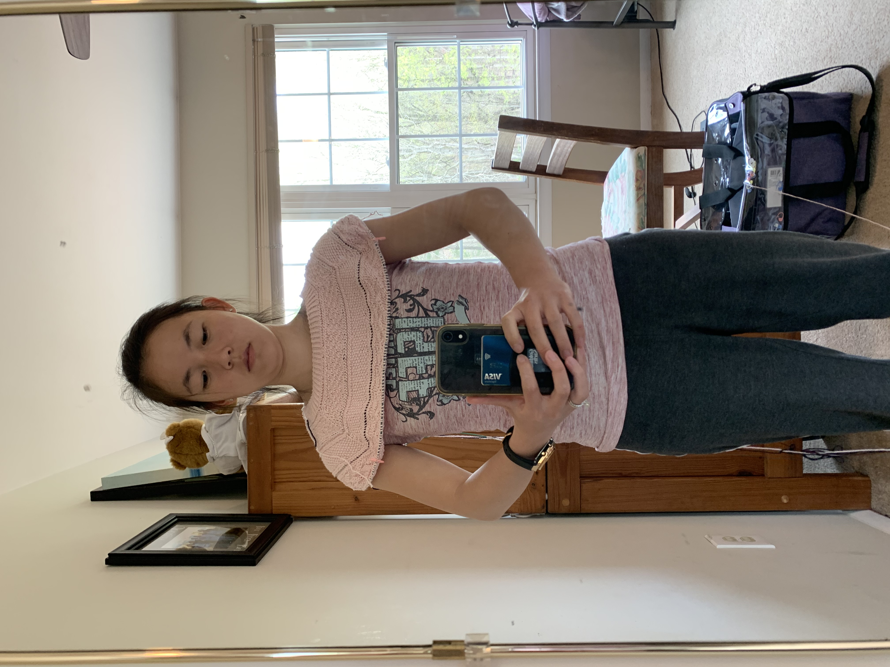



(Apr 2021) My first knit wearable! 

## Details
- Yarn: King Cole Finesse Cotton Silk DK (77% cotton, 23% silk), 5 skeins
- Needle size: 4 and 5
- Pattern: [Battersea shirt](https://incorrigiblecraftster.blogspot.com/2015/04/battersea-free-pattern.html)

## Notes

I have been wanting to make a knit wearable for some time now but given that I missed making a sweater in time for winter, I decided to try my hand at a knit shirt. I figure this will be good too because it's less commitment than a full blown sweater. I found a nice free pattern with lots of positive reviews, so here goes! 

## Timeline 

- 4/3/2021: Bought the yarn! I went to the most wonderful yarn store (the only yarn store I've ever been in) in downtown Vienna and they had so many different types of yarns and tools! I've heard before that if you want to make a summer shirt, it's best to use cotton (so it can breathe more) vs. if you want to make a winter sweater, it is better to use wool (so it is warmer). The lady at the yarn store mentioned that 100% cotton yarns can get sort of heavy, but if you use a cotton blend with silk, cashmere, etc. then it makes the yarn a bit lighter and flowier/lighter/softer. I saw super torn between 3 yarns: 
  1. Berroco Remix Light: cotton blend with mostly nylon, cotton, and acrylic, with a bit of silk and linen thrown in. This would've been $24 with probably a bit of yarn leftover (so maybe more like $20-22?) and is machine washable! 
  2. King Cole Finesse Cotton Silk Yarn: cotton blend with mostly cotton and some silk to make it lighter and airier. This would've been $30 with maybe a very little bit left over. It is hand wash only.
  3. Some cotton blend with cashmere which was super nice and soft. I don't quite remember, but I think this was closer to $50 and I'm guessing was hand wash only.

  Anyways I ended up just getting #2 because it wasn't too much more expensive than #1 and I've always heard that acrylic is bad (although I felt some of the softest acrylic ever in this wonderful yarn store!). But boy is this going to be the most expensive shirt ever! I figure it is the entertainment of it too hopefully. And if I don't need as much yarn, then I can return 1 ball (within 30 days of purchase for store credit) and it will only be $25! Still a lot though :( 
  
  I've heard that gauge swatches are really important for wearables so I made my first gauge swatch. I knit it flat instead of in the round with long floats which maybe would've been more accurate. Honestly, I don't know if it really will help me at all though. These were my gauge results (where when I say blocked, I really just mean soaked in cold water and lain flat to dry, not pinned): 
    - Pattern calls for: 18st x 32 rows 
    - My gauge swatch, size 6 needles (unblocked): 20st x 29 rows 
    - My gauge swatch, size 6 needles (blocked): 20st x 30.5 rows
  I guess by this, it would mean that I had to go up a size to match the st gauge (which is apparently more important than row gauge) but I don't want there to be too many holes in my shirt otherwise it will be see-through and I was actually thinking about going down a needle size instead of up! Anyways so I just decided for now that I will do the same needle size and perhaps go up a size in the pattern than I otherwise would have. 
  
  Side-note: The yarn is so soft in my gauge swatch! I am excited :) 
  
- 4/5/2021: Cast on! Given some of the comments from other people who have made this pattern, it sounds like the neckline can be a bit gigantic. So I did 128st (8 st less than the smallest size) and will increase up to the 2nd smallest size (35.5" circumference). Wish me luck! 

- 4/6/2021: Well I got as far as the 1.25" of twisted rib and a few of the increase rounds. But I was really worried that the shirt would be a bit see through and I probably should've just pushed through but I wasn't happy with it so I decided to rip it out and go down a needle size. Sigh, I'm dumb. I'll need to reset the frogged yarn becuase right now it looks like crazy ramen but apparently tying it up like a hank, soaking it in cold water, and then drying will do the trick! In the meantime, I am using a new ball. 

- 4/7/2021: Swatched with size 5 needles instead of size 6. The fabric feels a bit stiffer so less drape but it definitely is less see through which is good! I think I will stick with the size 5 needles. I made a mini gauge swatch (in the round this time instead of flat) and I am getting:
    - Pattern calls for: 18st x 32 rows 
    - My gauge swatch, size 5 needles (unblocked): 20.5st x ~32 rows (8 rows in 1" swatch) 
   
  Given this I am planning on CO 136st (128st last time was a good size for larger needles) and either knitting the 2nd smallest (35.5") or the 3rd smallest (37") size. Hopefully I have enough yarn! 
  
  I was much more careful (read: tighter tension) with my ribbing this time, and it looks miles better! I am glad I decided to rip it out previously, although it is much stiffer than before. I am just about done with the ribbing section and moving on to the increase section. Progress picture below! 
  
  
  
- 4/8/2021: Lifeline placed on/after first purl row after twisted rib. I used scrap sock yarn (I knew keeping those scraps around would be useful eventually!) and wanted to have it in place just in case I increase too much/too little for the neck to shoulder area. In the area between gansey patterns, it usually calls for 1 increase (every 3 rows) but I need to increase up to a larger size because of my smaller gauge. 

- 4/10/2021: Finished the first ball of yarn in the middle of the seed stitch section! I used the [second strategy from this video](https://www.youtube.com/watch?v=I_cHO6R_MBc) to attach a new ball of yarn and will weave in the ends afterwards. Progress picture!

  

- 4/13/2021: I ended up placing lifelines in each k, k, p, p, etc. section between the patterns. I also did more increases to get up to the 39" size from the smallest 34" size. I chose this because if you look at the total number of stitches and scale by my gauge / the pattern's gauge, then 39" is supposedly the best size for me. I guess we will see. 
  <table style="width:100%"> 
    <caption>Increases between twisted rib and first (gansey) pattern section</caption>
    <tr>
      <td>Stitch</td>
      <td>p</td>
      <td>p</td>
      <td>k</td>
      <td>k</td>
      <td>p</td>
      <td>p</td>
      <td>k</td>
    </tr>
    <tr>
      <td>Pattern increases</td>
      <td> </td>
      <td> </td>
      <td>*</td>
      <td> </td>
      <td> </td>
      <td>*</td>
      <td> </td>      
    </tr>
    <tr>
      <td>Modified increases</td>
      <td> </td>
      <td>*</td>
      <td> </td>
      <td>*</td>
      <td> </td>
      <td>*</td>
      <td> </td>      
    </tr>
  </table>  
  
  <table style="width:100%"> 
    <caption>Increases between gansey and seed stitch pattern sections</caption>
    <tr>
      <td>Stitch</td>
      <td>p</td>
      <td>p</td>
      <td>k</td>
      <td>k</td>
      <td>p</td>
      <td>p</td>
      <td>k</td>
    </tr>
    <tr>
      <td>Pattern increases</td>
      <td> </td>
      <td> </td>
      <td>*</td>
      <td> </td>
      <td> </td>
      <td>*</td>
      <td> </td>      
    </tr>
    <tr>
      <td>Modified increases</td>
      <td> </td>
      <td>*</td>
      <td> </td>
      <td>*</td>
      <td> </td>
      <td>*</td>
      <td> </td>      
    </tr>
  </table> 
  
  <table style="width:100%"> 
    <caption>Increases between seed stitch and parallelogram pattern sections</caption>
    <tr>
      <td>Stitch</td>
      <td>k</td>
      <td>p</td>
      <td>p</td>
      <td>k</td>
      <td>k</td>
      <td>p</td>
      <td>p</td>
      <td>k</td>
    </tr>
    <tr>
      <td>Pattern increases</td>
      <td> </td>
      <td>*</td>
      <td> </td>
      <td> </td>
      <td>*</td>
      <td> </td>
      <td> </td>
      <td>*</td>
    </tr>
    <tr>
      <td>Modified increases</td>
      <td> </td>
      <td>*</td>
      <td> </td>
      <td>*</td>
      <td> </td>
      <td>*</td>
      <td> </td>      
      <td>*</td>
    </tr>
  </table>  
  
  I have finished the parallelogram section and tried on the tee! It may be a *bit* baggy but it's hard to tell. But regardless, it is long enough (reaches my armpits) so I can separate out the arms and begin knitting the body.
  
  
  
  Finished the 2nd ball of yarn a couple rows after separating out the arms. Backwards cast on 7 st under each arm. Progress picture below. 
  
  
  
- 4/19/2021: Finished the 3rd ball of yarn! I finished all the patterns at the top and am working on the sea of stockinette. I have about 2.5" of stockinette so far. My gauge (non-blocked and non-washed of course) in the stockinette area so far is 23st by ~34 rows (17 rows in 2"). So it's actually a fair bit tighter than the original gauge swatch I did :/ But hopefully it shouldn't be a big deal, perhaps blocking will help it. Also I tried it on after finishing the last section of pattern, and it fits perfect so far! Progress picture below

  
  
- 4/22/2021: Finished the 4th ball of yarn! Here's a picture a couple rows before I finished the ball. The arms are a bit big and perhaps the body o fthe shirt is a bit baggy but good for the most part! :) 

  

- 4/26/2021: Finished the body of the sweater! Now time to do short rows and bottom ribbing!
  
    

- 4/27/2021: For short rows, I didn't want such a steep and deep dip on the lower back. So instead I did wraps and turns 3st from the end, and then every 4st thereafter (3st from end, 7st, 11st, 15st, and 19st). Then I picked up the stitches in one knit round around (following [this video](https://www.youtube.com/watch?v=Judt5ELRzRM) for how to do that in the round) and then knit one row even. My wrapped stitches are pretty messy, especially for the ones that were made on the purl side, which is a shame :( 

   &ensp;   

  But anyways, on to ribbing! Switching back down to a size 4 needle for the 1x1 twisted rib. 

- 4/29/2021: Well I wanted to make sure that I had enough for the arms (even though I technically still have a whole other ball of yarn left, but I am going to try to return it within the return window I think), so I decided to do ribbing on the arms before binding off the bottom of the body. I followed [this video](https://www.youtube.com/watch?v=8K-IsMdTHK0) for how to pick up underarm stitches and ensure that there aren't any holes. I did about 1" 1x1 twisted ribbing at the end of the arm and then bound off in twisted rib following [this video](https://www.youtube.com/watch?v=PYNl2xsz6iI). In another video, it recommended to leave a tail of about (4x + a little) the length of the part that needs to be bound off. I did 4x and had a lot left over so (3x + a little) probably would've been sufficient. 

- 4/30/2021: It is done! I did the bottom twisted rib for longer than 1" because I had plenty of yarn left. If I had to go back and do it again, I would've done the stockinette portion for longer before starting twisted rib (I should've finished the arms first so I didn't have to worry about saving enough yarn for the arms at the end). It looks really nice! But I have about 1.25 balls of yarn left :( I don't know what to do with it and the return window closes in 3 days and it's too far away from where we are right now. Oh well! 

  The short rows on the back worked perfectly! I didn't want it to be too obvious but I did want the benefits of short rows and it is nice and subtle but gets the job done. You can really only tell when the shirt is laid flat to compare the lengths of the front and back. 
  
  


