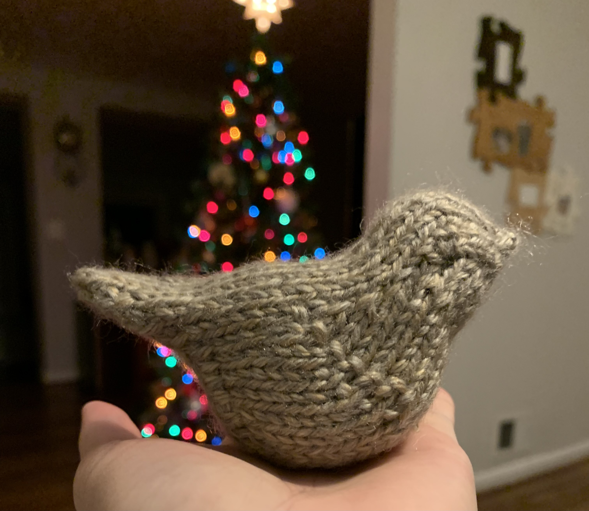



(Nov 2021) Bird amigurumi for our stocking advent calendar

## Details
- Yarn: Lion Brand Heartland (Grand Canyon) 
- Needle size: US 4 (3.5mm)
- [Pattern](https://www.ravelry.com/patterns/library/bluebird-of-happiness-4)

## Notes

Our advent calendar was supposed to be 25 mini stockings and at the start of the month, the garland would start empty and each day we would hang up a new stocking. That's still an option because each of the stockings is removable because there are buttons that each one loops over, but the garland looks pretty bad without the stockings hanging on it. I'm not sure if there was a more official way, but the way that I attached the buttons to the line, when there's nothing weighing down the buttons, they point in all crazy directions. So the latest plan is that we will instead have all 25 mini stockings hanging at the beginning of the month and we will have a little amigurumi that progresses along the length of the stocking throughout the month. Hopefully it looks ok! If not, I'm sure we'll figure something else out. 

Given recommendations of previous projects that made this pattern, I used a provisional cast on according to [this tutorial](https://www.youtube.com/watch?v=3OGG0AiJ3XE&t=2s). I'm also using magic loop with a 32" cable instead of DPNs. I was also planning on leaving an extra long tail when I first cast on (as recommended by [this project](https://www.ravelry.com/projects/tovella1/bluebird-of-happiness)) so that I could just finish the head with the long tail instead of needing to attach new yarn. But I forgot :( Oh well, it still worked! 

Note that the pattern calls for increases which are called M1 but the description actually seemed to align better with lifted increases. So I am increasing according to the 3rd technique in [this video](https://www.youtube.com/watch?v=oywVAE3cJ5Y&t=315s) and not doing what people traditionally call M1. 

I was also considering to make the tail a fan tail like the modifications in [this project](https://www.ravelry.com/projects/aliciawr/bluebird-of-happiness-4) but I ended up just following the pattern to a T. Maybe I will do a fan tail in the future! Fun little project, fairly quick to knit up and would likely be even quicker next time around when I know what I'm doing. Cool construction too because it's all just one piece! 


