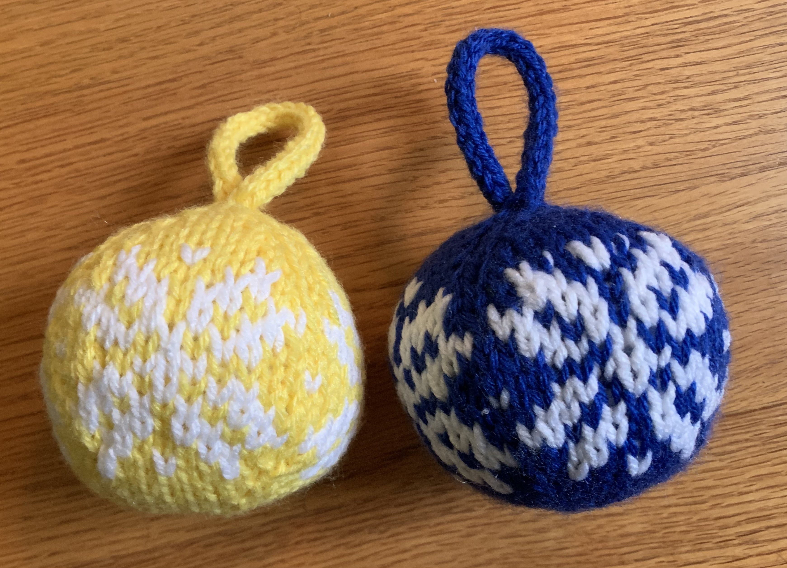



(Jan 2021) Unbreakable Christmas ornaments

## Details
- Yarn: Assorted worsted weight
- Needle size: 7 (4.5mm)
- [Pattern](https://www.ravelry.com/patterns/library/two-strands-christmas-ball)

## Notes

Jen mentioned the other day that Andy's mother made these paper Christmas ornaments which were a really good idea because then Summer could hang them up but Jen didn't have to worry about them breaking if Summer dropped them. Anyways it made me think that maybe knit Christmas ornaments would also be good for that purpose! I think they look less good than normal Christmas ornaments but at least they won't break if you drop them. So I made some knit Christmas ornaments - they would probably be much better with lighter weight yarn but I was trying to use up my cheap acrylic yarn (as usual). Stuffed with regular polyester fiber fill.


