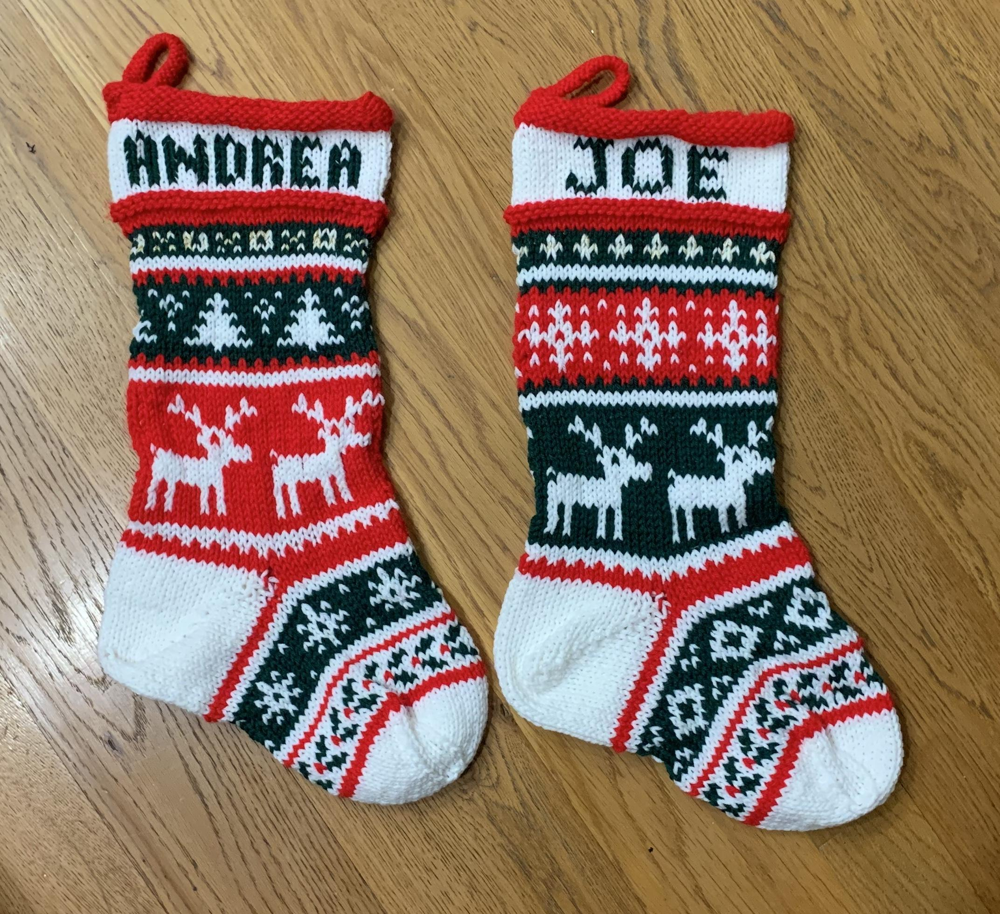



(Jul 2020 - Sep 2020) Christmas stockings for my hubby and me.

## Details
- Yarn: Assorted worsted weight 
- Needle size: 7, 40" circular
- [Pattern](https://lifeiscozy.com/patterns/#/cozy-season-stocking/).
- [Charts](https://docs.google.com/spreadsheets/d/1FZojCzyWK1Wb8Cg1hxHnl170SWNnqM_aZzWjw4F7KZU/edit?usp=sharing).

## Notes

I already made crochet Christmas stockings but 1) I didn't like the way the name looks stitched on, and 2) they're so uniform and boring! So I decided to do a nice knit colorwork one. I found a fantastic FREE [pattern](https://lifeiscozy.com/patterns/#/cozy-season-stocking/) which looks really good in my opinion! Unfortunately though, the pattern is written for DK/sport weight yarn and I only had worsted weight because I was trying to use up my cheap acrylic yarn stash. So it was time for some modifications! 

### Sizing

Instead of casting on 96st as the pattern calls for, instead I cast on 60 stitches. Given that the number of stitches on each side was much less, I had to modify the colorwork sections to fit in the 30st per side and still look good. See [my colorwork charts](https://docs.google.com/spreadsheets/d/1FZojCzyWK1Wb8Cg1hxHnl170SWNnqM_aZzWjw4F7KZU/edit?usp=sharing)! You can mix and match the different sections based on what you want the stocking to look like :) 

For the heel, I knit 2 rounds even in color (red for both) and then did the heel described in the pattern. This heel doesn't involve a heel flap or picking up any stitches and instead just involves short rows. After some trial and error, I followed the pattern with 14st on each side until 12 stitches in the middle, leaving 8 on each side. For the future, I probably could've done 15st on each side until 12 in the middle, leaving 9 st on each side. 

For the toe, after switching to white, I did: 
- one decrease row (k1, ssk, knit to last 3, k2tog, k1)
- one row knit even
- one decrease row
- one row knit even
- decrease every row until 8 stitches left on each side (16 total)
- bind off


