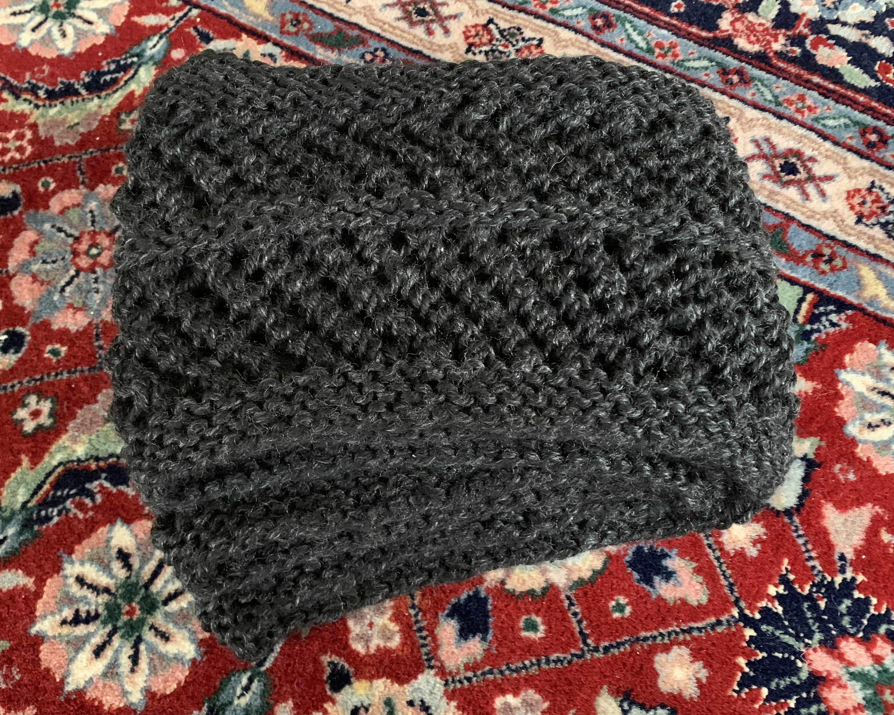



(Jul 2020) My first real knit project! 

## Details
- Yarn: Lion Brand Heartland, Black Canyon, 1 skein
- [Pattern](https://www.ravelry.com/patterns/library/copilot)
- Made for: my mom for Christmas 2020 

## Notes 
This was my first real knit project! I reduced the rows a bit to not run out of yarn as I only had one skein, but it still turned out PLENTY big. I should have used a stitch marker at the beginning of the round - I felt like I was slowly rotating the beginning of the round throughout the project. 

Fun fact: when I was making the bat amigurumi, I needed a bit more gray yarn and I didn't have any light gray left. So I unwound one row of this cowl, and used the extra yarn for the bat amigurumi (which was also incidentally a gift for my mom, just for her birthday). 


