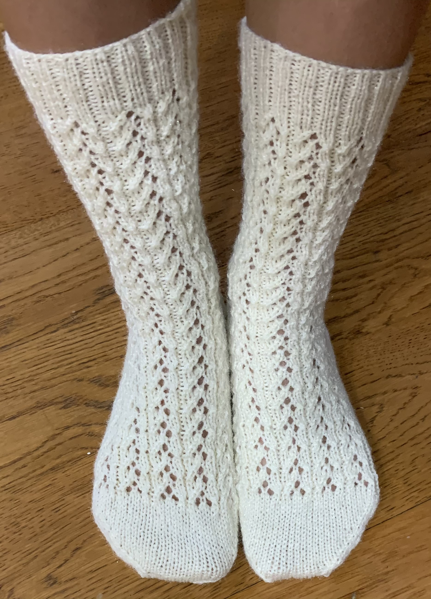

# Mercury socks

[*Back to home page*](..)

(Oct 2020) My second sock pattern! 

## Details
- Yarn: Twinkle yarn, 100% acrylic
- Needle size: 2 (2.75mm) 
- [Pattern](https://www.ravelry.com/patterns/library/mercury-socks)
- Made for: my sister for Christmas 2020 

## Notes 
Much better tension than my first pair of socks despite the same needles, yarn, etc. I almost wanted to keep it for myself, but they're for my sister for Christmas :( 

I also learned how to knit continental on this project! It was slow-going at first but I think has helped a lot with my speed since :) 
