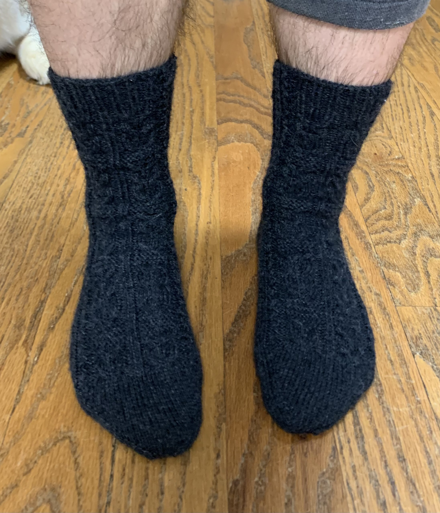

# Owlie socks

[*Back to home page*](..)

Dec 2020 - Jan 2021
Socks with owls on them for the hubby :) 

## Details
- Yarn: Patons Kroy Socks, Gentry Grey, 2 skeins total (100g)
- Needle size: 2 (2.75mm) 
- [Pattern](https://www.ravelry.com/patterns/library/owlie-socks)
- Made for: hubby :) 

## Notes 
I recently bought a ChiaoGoo 9" circular for sock knitting! I debated it for a long time, but decided to give it a shot instead of using my cheap 29" circular (which has a pretty terrible cable and join too). It makes everything so much faster because you just scoot around the circle instead of needing to switch and reorient every half row. I use stitch markers now to indicate start and middle of each row but it is so nice! You still need to switch to a long circular for the heel and toe but for the majority of the sock, you can use the 9". 

The pattern is knit top down. It calls for beads for the owl's eyes but I used a purl stitch instead. It is pretty hard to tell that these are owls, especially with the dark yarn, but Joe still likes it and apparently they are cozy and warm. 

I used 64st per round as that's what's worked out well for me in previous socks, but perhaps I should have gone up a little in size. The sock is pretty tight, and especially the top near the calf. I casted on using the German twisted cast on which is stretchier than a normal cast on, and I *think* I cast on with a size 4 needle. But the top of the cuff is still pretty tight.

I did two repeats of the owlie motif on the sock cuff, then 3.5 repeats on the gusset/foot. 40st heel flap with 
- Row 1: k3, (k1 sl1), k3
- Row 2: k3, p across, k3
- Row 3: k3, (sl1 k1), k3
- Row 4: k3, p across, k3

Plain toe following the decreases described in the pattern. I also rotated the pattern 45 degrees so the owls would be closer together on the top of the foot, instead of on the side of the foot. 


