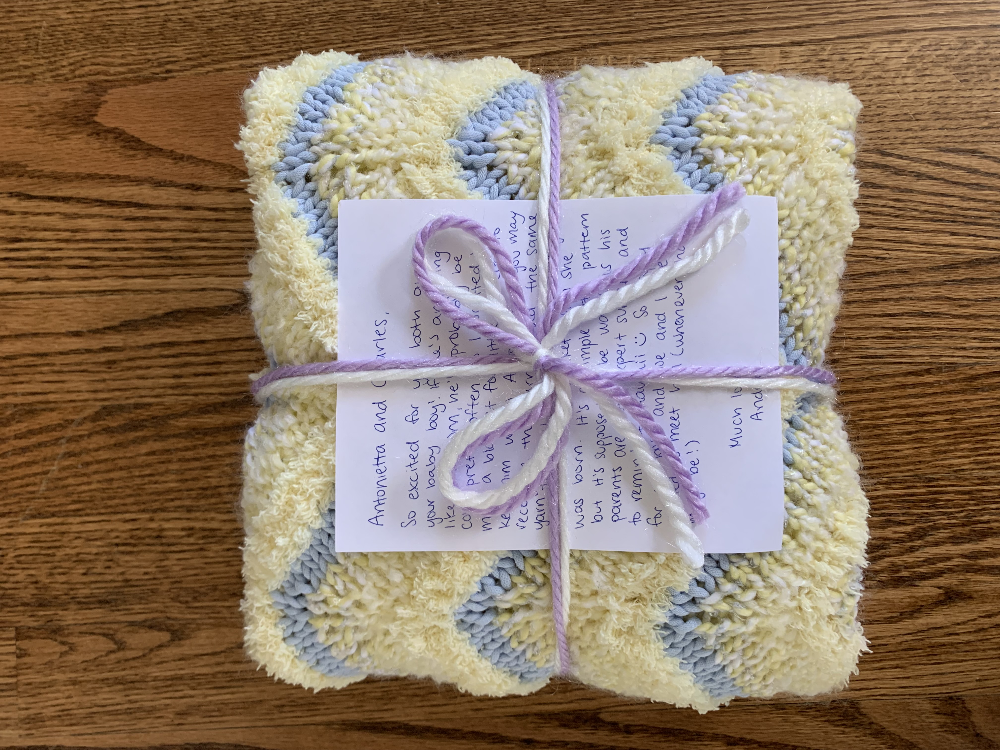



(Mar 2021 - May 2021) Robert Vaillancourt's baby blanket

## Details
- Yarn: Bernat 
- Needle size: US 10.5 (6.5mm) or US 11 (8mm) I think? 
- [Pattern](https://www.ravelry.com/patterns/library/chevron-baby-blanket-19)

## Notes
Antonietta and Charles had their first baby! I wanted to use the yarn that Antonietta had gifted to me (it was leftover yarn from when Antonietta had made a blanket for Summer when Jen was first pregnant). I was originally going to do a cute sailboat pattern but because of the really fuzzy yarn, you couldn't really see it at all. So I frogged it and just went with something simple. I added a garter border (I think 4 st on each side but I don't quite remember) so the blanket wouldn't curl and then just followed the pattern (going for sand and ocean waves). I forgot to take a picture before I packaged it up though :( But I hope it keeps Robert warm! 


