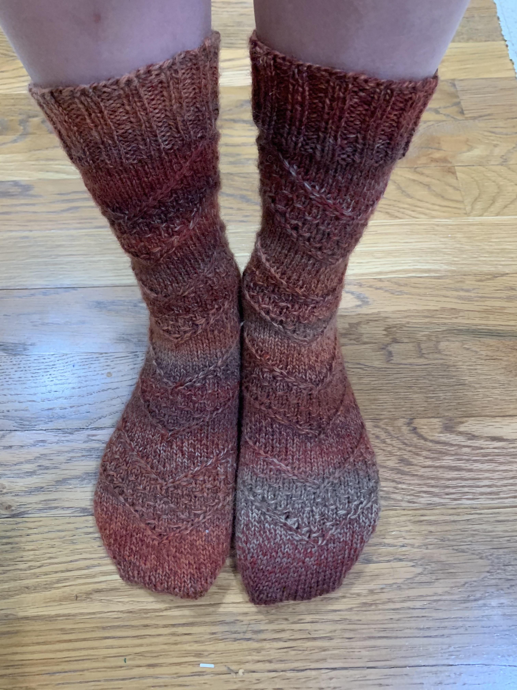
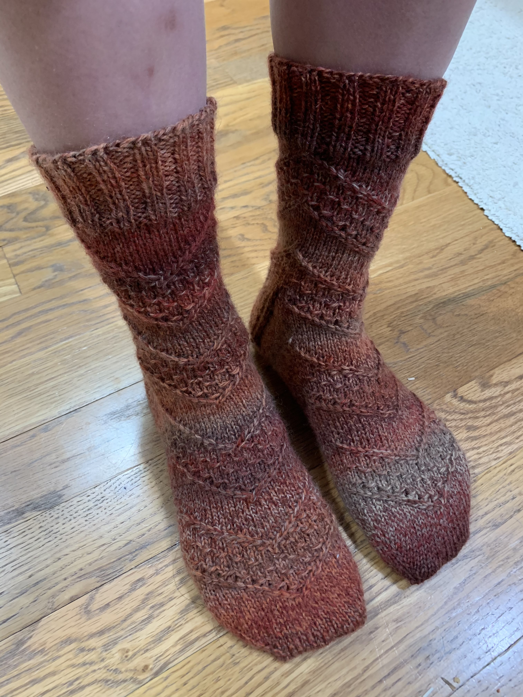
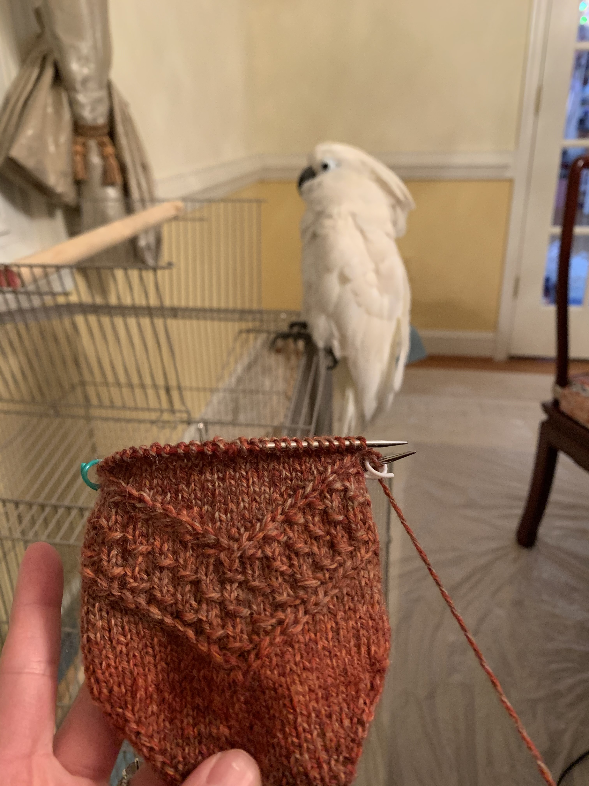
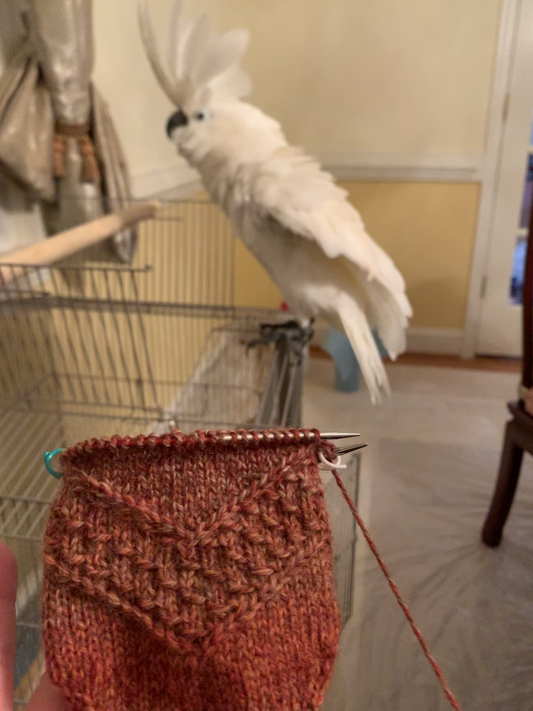
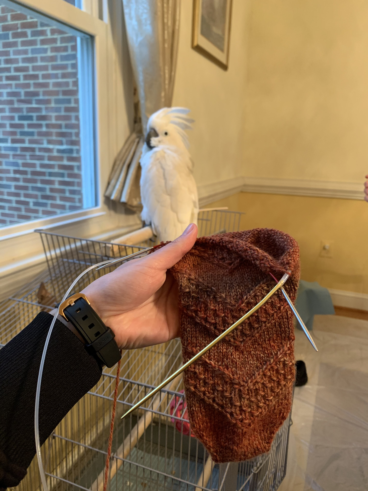
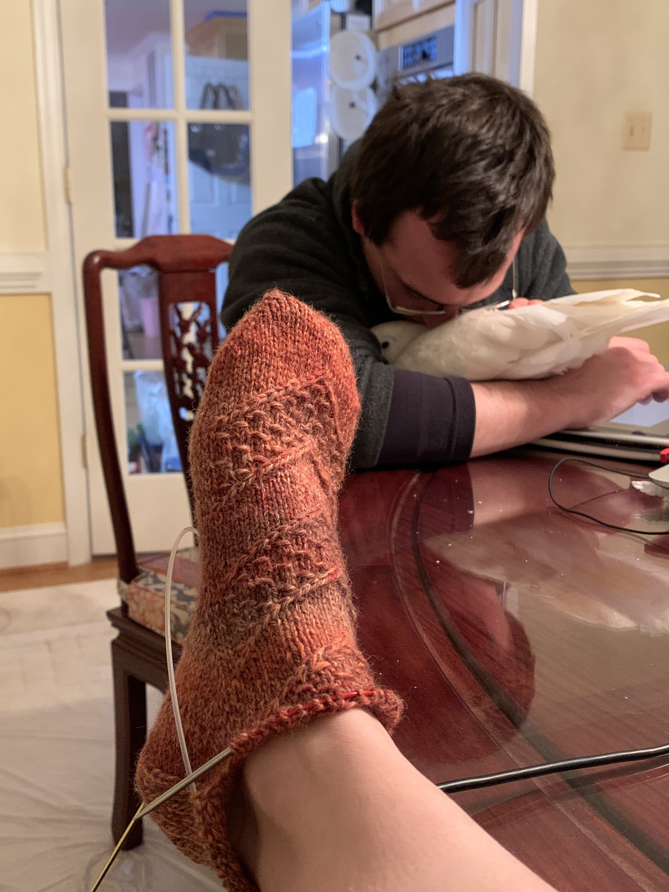
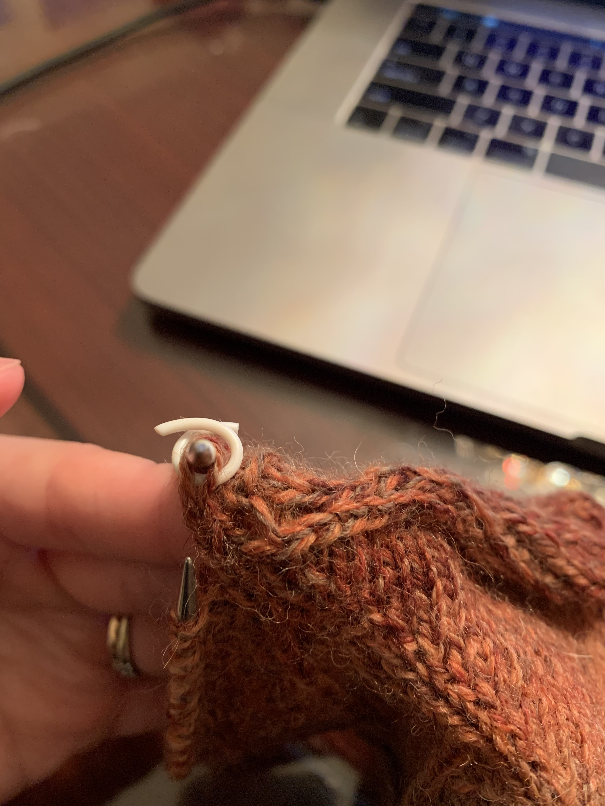
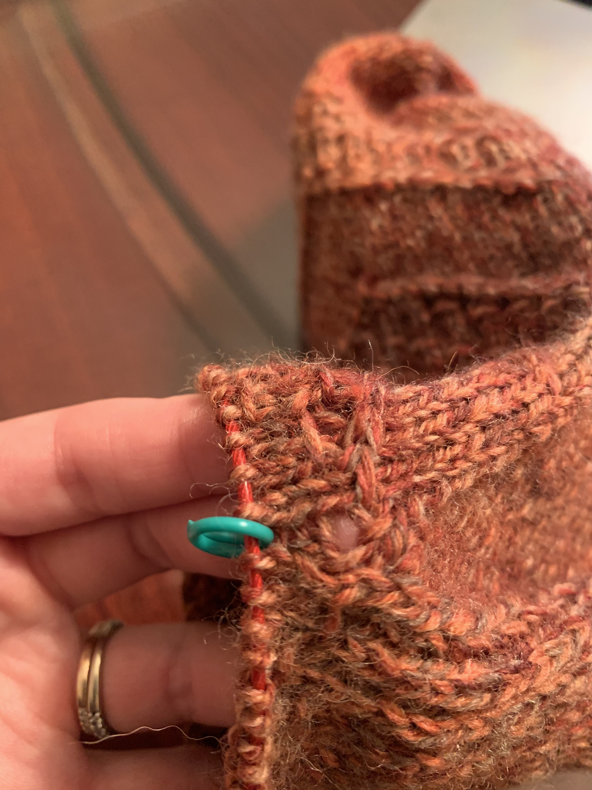
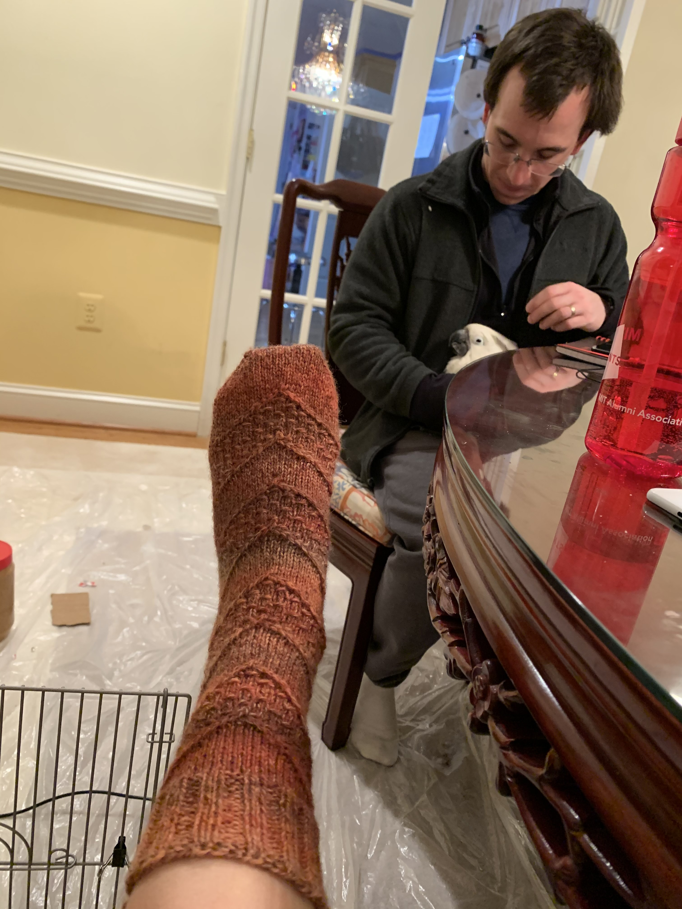

# Speckled space socks

[*Back to home page*](..)

(Feb 2021 - ongoing) My first toe up sock

 &ensp; 

## Details
- Yarn: Patons Kroy Socks, Copper Colors, 2 skeins total (100g)
- Needle size: 2 (2.75mm)
- [Pattern](https://www.ravelry.com/patterns/library/speckled-space-socks)

## Notes

My first toe up sock so I needed to start with my (very cheap, low quality) 29" circular needle before switching to my fancy Chiaogoo 9" circular. I followed Judy's Magic Cast On per [this video](https://www.youtube.com/watch?v=1pmxRDZ-cwo) instead of the tutorial that was linked in the pattern. 

I started with the medium size (64st around) because all the socks I've knit so far are 64st around. But then it was too big so I frogged and did the small size instead. I didn't frog to the beginning so I still have the medium size (14st each) cast on instead of the small size (12st each) cast on. I used [Jeny's Surprisingly Stretchy Bind-off](https://www.youtube.com/watch?v=ol8aZ7z_ISs) to bind off.

## Timeline

- 2/5/2021: Started! 

- 2/8/2021: The sock was too big :( Unstretched, it was about the size of Joe's Owlie socks (after he's been wearing them so they're a little stretched out). I offered them to Joe but he said I should make a pair for myself so I decided to frog and make the small size instead. Of course, like a dingus, I forgot to take a picture before frogging. I had reached row 16 on the medium chart.\
Finished 1 chart repeat of the small size! Fits well so far! Lacy is so cute :) \
 &ensp; 

- 2/9/2021: Oh boy I am not enjoying toe up socks! They are supposed to be more convenient because you don't have to be worried about running out of yarn while you are doing the foot, but I think it is so much harder to know when to start the gusset! I have been stressing and cannot decide! I decided to start the gusset on row 11 of the 2nd repeat. 

- 2/10/2021: I am flying, I'm already on the leg! The heel turn was very puzzling (much less intuitive than top down socks in my opinion) but I trusted the pattern and made it through. The heel flap was really nice because you didn't have to pick up any stitches. \
 &ensp;  \
In order to prevent a hole between the heel flap and leg, I picked up an extra stitch on each side (not the flat bar otherwise another hole would form, but if you follow the bar, the next stitch over) and knit it. On the next round I k2tog to eliminate the extra stitch. There is still a little hole on one side, but much smaller than it would have been otherwise. \
 &ensp;  

- 2/11/2021: I am so mad! I didn't read the pattern carefully enough and didn't realize that there is a different chart for the leg vs foot :( I did about 15 rows before realizing so now I need to frog again. Ugh :( And hope to not lose any stitches! \
Well the silver lining is that because I was frogging anyways, I picked up an extra extra stitch (so 2 extra stitches total) in the part of the foot where there was a little hole between the heel flap and the leg. So no hole now! The leg chart is very confusing. It seems it was written this way because it was written for magic loop instead of 9" so the stitches need to be close together for the cables/yarnovers. Essentially for rows 14-24, if the stitch in col 29 is a normal knit stitch, then you just knit the first stitch of the row. If it's anything else i.e. yarnover or cable, then you slip the first stitch as if to purl and then do it when you come around at the end of the row. At least I think that's how you do it. 

- 2/12/2021: I messed up :( I somehow forgot to do one of the cables and I noticed it on the following row but didn't think it was worth it to ladder down and fix becuase I thought it wouldn't be very noticeable. A few rows later and I think it is quite noticeable. But because of the cables, laddering back is pretty complicated and I don't want to tink/frog back. So I am just going to leave it in and hope that it is not *too* bad. But it is on the front of the sock too :( I am sad

- 2/15/2021: I finished my first sock! I used [Jeny's Surprisingly Stretchy Bind-off](https://www.youtube.com/watch?v=ol8aZ7z_ISs) to bind off. Now just need to muster up the willpower to do the next one. I had a LOT of leftover yarn at the end :( So perhaps I will just collect all of my leftover sock yarn and make something at some point in the future. We'll see!

   

- 2/16/2021: Started 2nd sock. All these notes were super helpful to make it identical :) 

- 2/25/2021: Officially finished the 2nd sock! Technically I finished it yesterday but I cut and wove in the ends today. They are a *little* bit big on the foot I think but very comfy otherwise. Let's see if they are warm :) 

Well that was a nice distracting project. Back to the Christmas tree skirt I guess (I bought a new skein of red yarn). 


