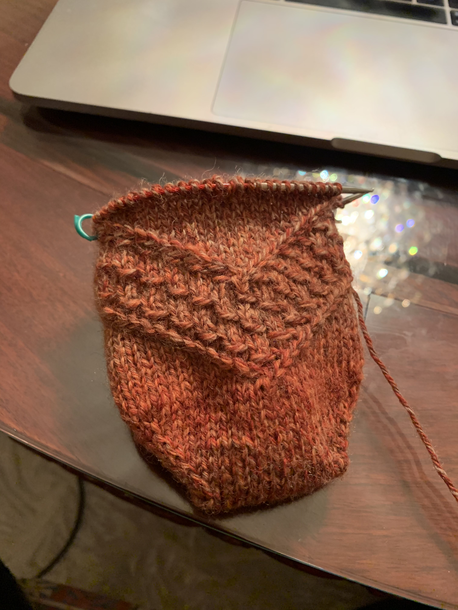

# Speckled space socks

[*Back to home page*](..)

(Feb 2021 - ongoing) My first toe up sock

## Details
- Yarn: Patons Kroy Socks, Copper Colors, 2 skeins total (100g)
- Needle size: 2 (2.75mm)
- [Pattern](https://www.ravelry.com/patterns/library/speckled-space-socks)

## Notes

My first toe up sock so I needed to start with my (very cheap, low quality) 29" circular needle before switching to my fancy Chiaogoo 9" circular. I followed Judy's Magic Cast On per [this video](https://www.youtube.com/watch?v=1pmxRDZ-cwo) instead of the tutorial that was linked in the pattern. 

I started with the medium size (64st around) because all the socks I've knit so far are 64st around. But then it was too big so I frogged and did the small size instead. I didn't frog to the beginning so I still have the medium size (14st each) cast on instead of the small size (12st each) cast on. 

## Timeline

- 2/5/2021: Started! 

- 2/8/2021: The sock was too big :( Unstretched, it was about the size of Joe's Owlie socks (after he's been wearing them so they're a little stretched out). I offered them to Joe but he said I should make a pair for myself so I decided to frog and make the small size instead. Of course, like a dingus, I forgot to take a picture before frogging. I had reached row 16 on the medium chart.\
Finished 1 chart repeat of the small size! Fits well so far! Progress picture and picture with Lacy :) 
 &emsp; 

