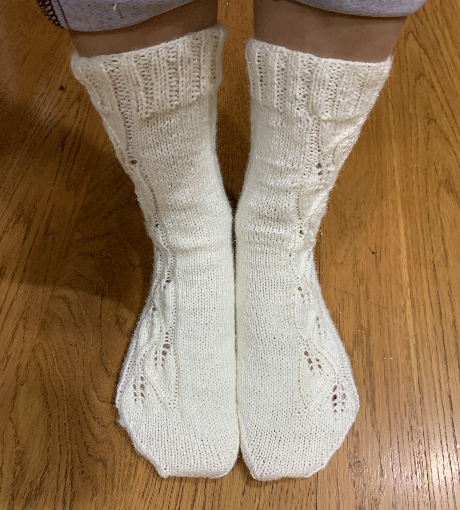
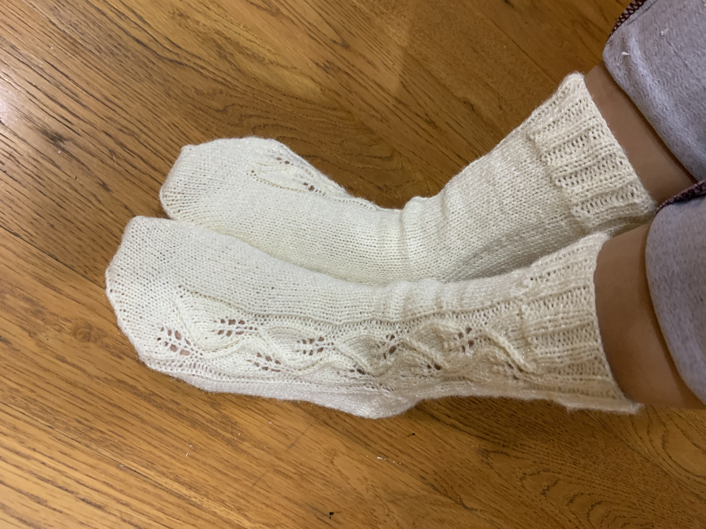

# Woodland walk socks

[*Back to home page*](..)

(Oct 2020) My first sock pattern! 

## Details
- Yarn: Twinkle yarn, 100% acrylic
- Needle size: 2 (2.75mm) 
- [Pattern](https://www.ravelry.com/patterns/library/woodland-walk-socks)
- Made for: my sister for Christmas 2020 

## Notes
This was the first pair of socks I have knit! The pattern was lovely to knit - interesting enough to not become too monotonous but also simple enough to eventually memorize. It also looks very nice. 

The tension is a little wonky - the socks definitely could've been a little bit tighter but all in all, pretty good for my first pair of socks if I do say so myself! 
